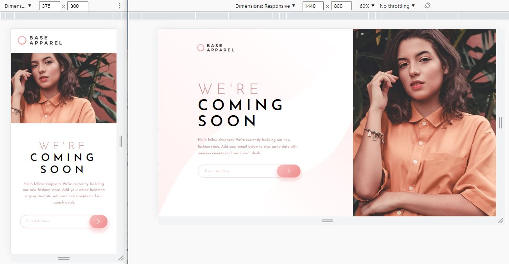

# Frontend Mentor - Base Apparel coming soon page solution

This is a solution to the [Base Apparel coming soon page challenge on Frontend Mentor](https://www.frontendmentor.io/challenges/base-apparel-coming-soon-page-5d46b47f8db8a7063f9331a0). 

## Table of contents

- [Overview](#overview)
  - [The challenge](#the-challenge)
  - [Screenshot](#screenshot)
  - [Links](#links)
- [My process](#my-process)
  - [Workflow](#workflow)
  - [Built with](#built-with)
  - [What I learned](#what-i-learned)
  - [Continued development](#continued-development)
  - [Useful resources](#useful-resources)
- [Author](#author)
- [Acknowledgments](#acknowledgments)

## Overview

### The challenge

Users should be able to:

- View the optimal layout for the site depending on their device's screen size
- See hover states for all interactive elements on the page
- Receive an error message when the `form` is submitted if:
  - The `input` field is empty
  - The email address is not formatted correctly

### Screenshot

### Links

- Solution: [frontendmentor.io](https://your-solution-url.com)

- Live Site: [app.netlify.com](https://ba-coming-soon-page.netlify.app/)

## My process

### Workflow
 - Setting up workflow (Creating React app using `npx create-react-app my-app` command, Preparing README.md) 
 
 - Identifing and Creating Components
    - Layout, Header, Hero, UnderConstruction, SubscribeForm, ComingSoon

 - Working on mobile design based on `desing` folder

 - Working on desktop design based on `desing` folder

 - Working on email validity using React hook

 - Writing README.md

 - Publish on github.com | app.netlify.com | frontmentor.io

### Built with

- React
- React CSS module
- Mobile-first workflow
- Semantic HTML5 markup
- Flexbox
- CSS Grid

### What I learned

As a result, I learned how to think about the structure of a page in terms of components as well as the state of my components. Also, I learned how to install SVG images in React

### Continued development

This is my first challenge that I used React for that

The upcoming challenges will be done using React, so I can practice using it.

### Useful resources

- [Adding Images in React](https://create-react-app.dev/docs/adding-images-fonts-and-files/)

- [Store image assets in public or src folder](https://stackoverflow.com/questions/44643041/do-i-store-image-assets-in-public-or-src-in-reactjs)

- [Modern normalize](https://github.com/sindresorhus/modern-normalize) - for Normalize browsers default style

## Author

- Frontend Mentor - [@siavhnz](https://www.frontendmentor.io/profile/siavhnz)

- Github - [@siavhnz](https://github.com/siavhnz)

- Codepen - [@siavhnz](https://codepen.io/siavhnz)

## Acknowledgments

Thanks To

[Frontendmentor.io](https://www.frontendmentor.io/challenges) - for their Excitement challenges  

[Perfect Pixel](https://chrome.google.com/webstore/detail/perfectpixel-by-welldonec/dkaagdgjmgdmbnecmcefdhjekcoceebi?hl=en) - for such a great extension

